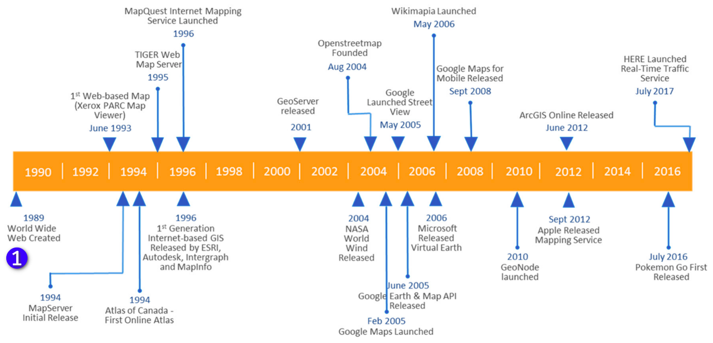
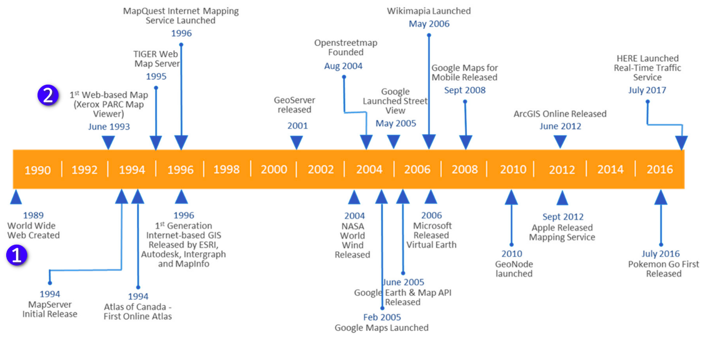
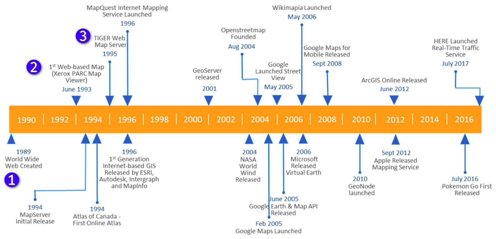
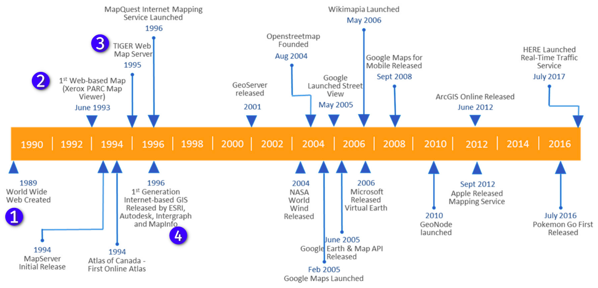
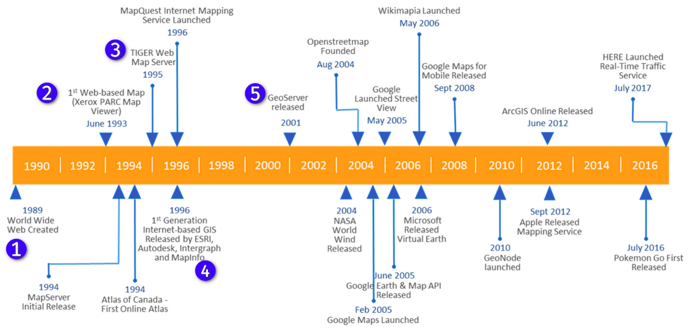
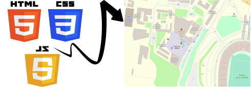

```{r setup, include=FALSE}
options(htmltools.dir.version = FALSE)
library(knitr)
knitr::opts_chunk$set(warning = FALSE, message = FALSE)
library(tidyverse)
library(leaflet)
library(leaflet.extras)
library(sf)
library(fontawesome) 
```

class: center, middle,inverse
background-image: url(./img/mybg.svg)
<h1><b>Aspectos generales</b></h1>
---
# 1. Acontecimientos históricos



######[*Figura01: Cronología de algunos acontecimientos significativos de la cartografía web*](https://www.mdpi.com/2220-9964/6/10/317/htm)

---
# 1. Acontecimientos históricos



######[*Figura01: Cronología de algunos acontecimientos significativos de la cartografía web*](https://www.mdpi.com/2220-9964/6/10/317/htm)

---
# Primer mapa web


######[*Figura02: Primer mapa web*](https://www.mdpi.com/2220-9964/6/10/317/htm)

---
# 1. Acontecimientos históricos



######[*Figura01: Cronología de algunos acontecimientos significativos de la cartografía web*](https://www.mdpi.com/2220-9964/6/10/317/htm)

---
# 1. Acontecimientos históricos



######[*Figura01: Cronología de algunos acontecimientos significativos de la cartografía web*](https://www.mdpi.com/2220-9964/6/10/317/htm)

---
# 1. Acontecimientos históricos



######[*Figura01: Cronología de algunos acontecimientos significativos de la cartografía web*](https://www.mdpi.com/2220-9964/6/10/317/htm)

---
# 2. Tecnologías de desarrollo web 


---
# 3.Tecnologías web orientado al aspecto espacial


---
clase: center
background-image: url(./img/Leaflet_logo.svg)
background-size:100%
background-color: #000000

---
# 3.Tecnologías a usar:
# * HTML 
```
<!DOCTYPE html>
<html lang="en">
<head>
    <meta charset="UTF-8">
    <meta http-equiv="X-UA-Compatible" content="IE=edge">
    <meta name="viewport" content="width=device-width, initial-scale=1.0">
    <title>Mi primer mapa web</title>
</head>
<body>
    
</body>
</html>
```
---
# 3.Tecnologías a usar:
# * CSS
```
<link rel="stylesheet" href="https://unpkg.com/leaflet@1.7.1/dist/leaflet.css" />
```

```
#mapid{
    width: 100%;
    height: 100%;
   }
```
# * JS

```
<script src="https://unpkg.com/leaflet@1.7.1/dist/leaflet.js"></script>
```

```
var map = L.map('map',{center: [35.10418, -106.62987],zoom: 10});
L.tileLayer('http://{s}.tile.osm.org/{z}/{x}/{y}.png').addTo(map);
```

---
# Entonces 
<h2 align="center"><b>Webmap = HTML + CSS + JS</b></h3>
<br/>


---
# Resultado

```{r echo=FALSE,fig.height=7,fig.width=14.5,fig.align='center'}
leaflet() %>% 
  addTiles() %>% 
  addPopups(lat = -12.0556056,lng = -77.086536,popup = "<h3>Mi primer mapa web 🤓</h3>")

```

---
class: center, middle,inverse
background-image: url(./img/mybg.svg)
<h1><b>Leaflet en R </b></h1>
---
# 4.R 


---
# 5.Rstudio

---
# 6.Leaflet en R

- Instalación 

---
# 7.Componentes generales


--- 
# 8.Componentes avanzandos


---
# PARTE PRÁCTICA
---
# 9.Datos abiertos
---
# 10.Cheatsheet 
---
# 11.Código reproducible

---
# 12.Resultado

---
background-image: url(./img/mybg.svg)
class: center, middle,inverse
# ¡ GRACIAS ^^!
### Estos slides fueron creados en: [xaringan](https://github.com/yihui/xaringan) con [RMarkdown](https://rmarkdown.rstudio.com/)
